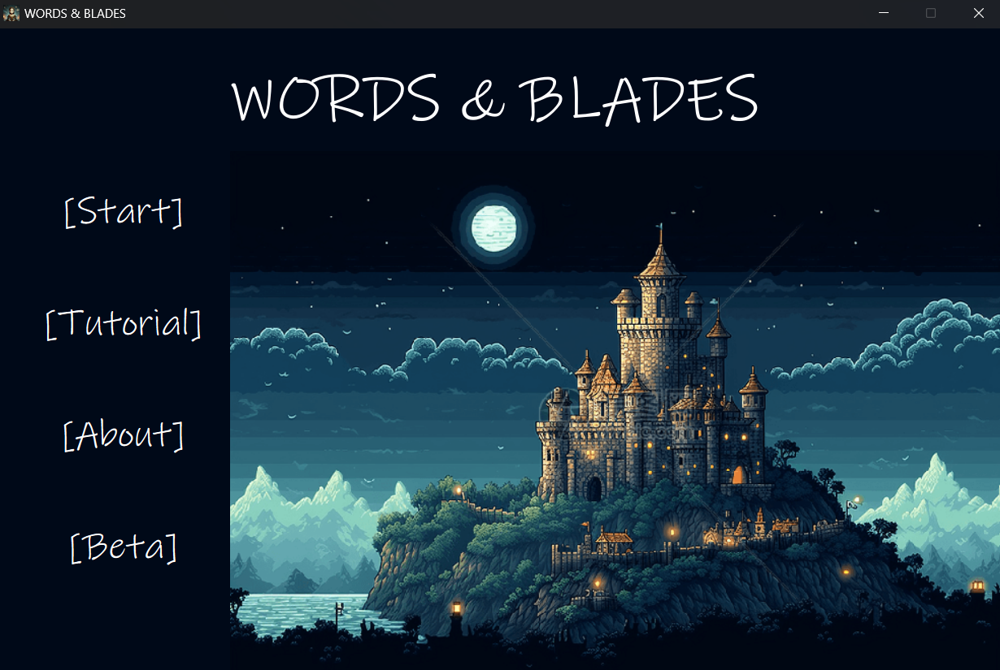

# FYP
JiagengZhu's final year project repository, including code and files

## Environment

* openai==1.66.3
* pygame==2.6.1
* PyQt6==6.8.1
* PyQt6_sip==13.10.0
* sentence_transformers==3.4.1

## Prerequisite

```shell
pip install -r requirements.txt
```

## Game Demo
A game demo can be donwloaded from this [link](https://drive.google.com/drive/folders/1IYEvQoBPmhyiMbKR5xGz81dVeU88A9yx?usp=sharing) (Windows version only)

